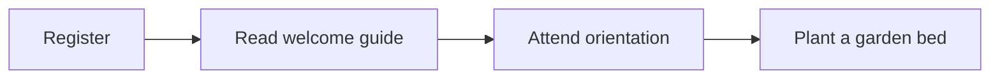

# Community garden launch {#plan}

A fictional example: prepare a shared garden for its first planting day. Success means
that plots, supplies, and volunteer information are ready before registration opens.

## Prepare the site {#site}

- [x] Map the planting beds and walking paths {#site-map}
- [~] Prepare soil and label each planting bed {#site-soil}
- [ ] Install a water station near the entrance {#site-water}

## Welcome volunteers {#volunteers}

- [x] Draft a one-page welcome guide {#volunteer-guide}
- [ ] Publish the registration form {#volunteer-form}
  - [ ] Add an optional accessibility request field {#volunteer-access}
- [?] Choose a morning or afternoon orientation {#volunteer-time}

## Planting day {#planting}

- [ ] Pack seeds, gloves, and hand tools {#planting-supplies}
- [!] Confirm the compost delivery date {#planting-compost}
- [-] Build a greenhouse in the first season {#planting-greenhouse}

## Volunteer journey {#journey}

## Review checklist {#review}

- [ ] Check that every task has a clear completion condition {#review-tasks}
- [ ] Resolve the orientation time before publishing registration {#review-time}

This example starts with no conversation or visit history. Click an item to add a note,
then send it to an agent running `planboard poll PLAN.md`. Stable anchors keep the
conversation attached as the plan changes.
