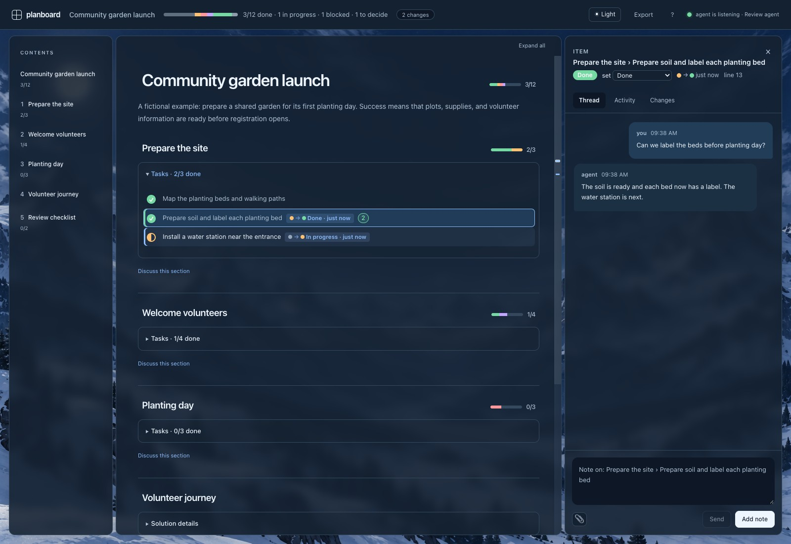
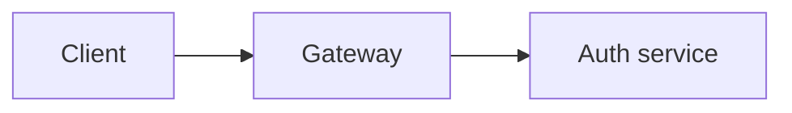

# planboard

A whiteboard for AI-agent plans.

The plan is a Markdown file the agent edits. planboard renders it as a live board in the
browser: you click an item, a heading, a node in a diagram or a spot on an image, write a
note, and press **Send**. The agent receives the notes - with everything already said about
that item - through a long poll, edits the plan, flips statuses as work lands, and answers
next to the item. Notes, replies and the status history persist beside the plan, so the same
board serves the whole project day after day. The plan is the conversation; the chat log is not.


<details>
<summary>See the dark theme</summary>



</details>

## Why

Reviewing a long plan in a chat transcript means scrolling up and down, re-reading, and
holding the chain of thought in your head. A whiteboard does that for you: every item shows
its status, every discussion hangs off the thing it is about, and "what moved since
yesterday" is a glance. planboard is that whiteboard, built for one person and their coding
agent.

It is modelled on [lavish-axi](https://github.com/kunchenguid/lavish-axi) - an
agent-operated review loop for HTML artifacts - but keeps the plan in Markdown, tracks item
status, threads the conversation per item, and remembers across days. See
`THIRD-PARTY-NOTICES.md` for what was borrowed.

## Install

```sh
git clone <this repo> planboard && cd planboard
npm install && npm run build     # browser bundle (Mermaid, ~3 MB) + the Excalidraw whiteboard frame (~8 MB, from lavish-axi)
npm link                          # puts `planboard` on your PATH
planboard setup claude --global   # installs the /planboard skill for Claude Code
planboard setup codex             # installs the planboard skill for Codex in .agents/skills
planboard setup cursor            # installs the Cursor skill and project rule (.cursor/skills + .cursor/rules)
planboard setup opencode          # installs the OpenCode skill in .opencode/skills
```

Node 22 or newer. Planboard runs locally and does not call model providers. Its browser talks to
`127.0.0.1:4747`; explicitly started validation commands may use their own configured network
access. The whiteboard frame is copied from the `lavish-axi` dev dependency at build
time; without it the board simply has no whiteboard button.

## The plan file

Links work in plan text and in both user and agent discussion messages, including
plain URLs and Markdown links. Link to a section, item, or diagram with its stable
ID, such as `#breaking` or `http://localhost:4747/boards/<key>#breaking`. Opening
a board link reveals a collapsed target and opens its discussion.

Run `planboard init` to create `.planboard/PLAN.md` at the repository root, even
from a subdirectory. Outside Git, it uses `.planboard/PLAN.md` in the current
directory. The folder is created automatically. To choose another location, run
`planboard init docs/launch.md`; explicit relative paths resolve from the current
directory, and absolute paths are also supported. Existing plans stay where they are.

Open the default plan with `planboard .planboard/PLAN.md` from the repository root.
In the examples below, replace `PLAN.md` with your actual plan path.
Notes and history live beside the plan by default, so the default plan uses
`.planboard/PLAN.board/`. `PLANBOARD_STATE_DIR` still overrides the history location.

Ordinary Markdown plus three conventions:

````markdown
# Auth rollout {#plan}

## Phase 1 {#p1}

- [x] Login endpoint {#p1-login}
- [~] Rate limiting on /token {#p1-rate}
  - [ ] Bucket config {#p1-rate-cfg}
- [!] Audit log - blocked on the logging vendor {#p1-audit}
- [?] Keep basic auth for legacy clients? {#p1-legacy}
- [-] Dropped: per-tenant keys {#p1-tenant}




````

| Convention | Meaning |
| --- | --- |
| `[ ]` `[~]` `[x]` `[!]` `[?]` `[-]` | to do · in progress · done · blocked · needs a decision · dropped |
| `{#id}` at the end of an item, heading or fence info | the stable anchor threads and history key on; never rename one |
| ```` ```mermaid <id> ```` | a clickable diagram; you can note on a single node |
| `` | an image you can pin a note to at a point |

Plain bullets without a checkbox are notes, not tracked items. Raw HTML/SVG passes through.
`planboard lint PLAN.md` reports items without ids and duplicate ids; `planboard init` scaffolds
a plan with the conventions in a comment.

## The loop

Planboard agents modify files by default. They must not create commits, create
branches, or push unless the user explicitly requests that Git action.

```
you                                  agent
────────────────────────────────     ──────────────────────────────────────
                                     planboard PLAN.md          → board URL
open the board
click an item · write note · Send    planboard poll PLAN.md     → JSON: notes + item + thread
                                     edit PLAN.md, planboard set <id> <status>
board re-renders live                planboard reply PLAN.md --to <note-id> "…"
read the reply next to the item      planboard poll PLAN.md …
```

- **Board** (left): the plan. Green check = done, half blue = in progress, red `!` = blocked,
  purple `?` = needs your decision. Section headers carry a stacked progress bar. The **Contents** sidebar jumps to sections
  and shows progress and section discussion counts. Contents numbers follow the
  Markdown heading order automatically: `1`, `1.1`, `1.1.1`. The document title
  is unnumbered. Use `##` for main sections and `###` for subsections; keep sections
  in their intended order and do not type numbers into heading titles. Each second-level section has
  independently expandable **Solution details** and **Tasks**; opening another section’s
  details closes the previous one. **Expand all / Collapse all** controls the full outline.
  **Discuss this section** opens its attached conversation. Expansion choices are saved
  per board, and selecting a hidden item reveals its containing group.
  Items with notes carry a count badge (dashed = not sent yet, filled = waiting for the agent,
  green = agent answered last, 📎 = attachments). Items that changed since your last visit get a
  coloured left rail and a tag drawing the move (old-status dot → new-status dot). The thin
  **ruler** on the right edge is a minimap of where the changes and notes are along the whole
  plan - click a tick to jump.
- **Panel** (right): the thread on whatever you selected - an item, a heading, a diagram node, an
  image point, a text selection, or the whole plan. **Activity** is everything in time order with
  day separators; **Changes** is the review view (below).
- **Composer**: Enter adds a note (it stays "not sent" until you press **Send**, so you can walk
  the whole plan first); ⌘/Ctrl+Enter adds and sends; Esc goes back to the whole plan. You can
  also flip an item's status yourself from the panel. Paste or drop a
  screenshot (or use 📎) to attach it: it is stored beside the plan and shown in the thread.
- **Top bar**: the stacked status bar, the changes chip, **Export**, and agent presence - *no agent
  listening*, *agent is listening* (a poll is attached), *agent is working on your notes*
  (delivered, no reply yet). The listening agent's `--owner` label is shown next to it, so you can
  see which model and effort level will read your notes: that is decided by the agent session that
  runs the poll, not by planboard, which never calls a model itself.
- **Keyboard**: `j`/`k` move between items, `Enter` opens the thread and the note box, `Esc` goes
  back to the whole plan, `n`/`p` walk through the changes, `1`/`2`/`3` switch tabs, `?` shows the cheat sheet.
- **Phone**: under 900 px the panel is a bottom sheet - tap an item to open it, swipe it down with
  the handle or Esc.

### Reviewing what changed


The **Changes** tab is drawn, not listed, so a morning catch-up is a glance:

- a **flow chart**: the item statuses at your last visit and now as two stacked bars, with a band
  per movement between them (to do → in progress, in progress → done, added, removed), unchanged
  items faint;
- a **timeline** of when the changes happened;
- **per-section deltas**: done count then → now, newly done items highlighted, started items in
  blue;
- one **card per changed element**, in plan order: status pills with arrows, `added` / `removed`
  tags, a word diff for rewordings, and for diagrams a **Show before** switch that redraws the
  previous version of the diagram on the board itself;
- a **walk-through** (‹ › or `n`/`p`) that steps through the changes, highlighting each on the
  board.

### Diagram viewer

Use **View** beneath a Mermaid diagram (or **View diagram** in its discussion panel) to
open a read-only viewer in the board's theme. Zoom with **+ / −**, choose **Fit** or
**100%**, and drag or scroll to move around. Press **Esc** to return to the plan.

**Copy image** copies a PNG for pasting into a message or document; **Download PNG**
and **Download SVG** save the full diagram, independent of the current zoom. Image
copying requires a browser with clipboard support on HTTPS or localhost; downloads
also work when accessing a board over plain HTTP on your local network.

### Whiteboard

Every Mermaid diagram has a **✎ Whiteboard** button (also in the panel when a diagram or node is
selected). It opens the diagram converted to an editable Excalidraw scene - lavish-axi's built
frame - where you move boxes, add arrows, write on it. **Queue feedback** in the frame turns the
edits into a note on the diagram: a list of what you added, removed, moved or relabeled, a PNG of
the sketch and the `.excalidraw` scene, stored in `PLAN.board/attachments/`. You send it like any
other note; the agent reads the summary, looks at the picture, and changes the Mermaid source.
The working scene autosaves per diagram, so re-opening continues where you left off.
Imported connectors keep Mermaid's routed segments without sketch smoothing, and
filled nodes sit above connectors so lines cannot obscure their labels. Older saved
scenes receive the same correction for untouched elements; your edits are preserved.

The agent's command contract is `planboard --help`. Installed skills point there and add
guidance for their host's polling tools.

## CLI

| Command | What it does |
| --- | --- |
| `planboard <PLAN.md> [--no-open]` | open or re-open the board (starts the local server if needed); prints the URL and the agent's next step |
| `planboard poll <PLAN.md> [--timeout <sec>] [--owner <label>] [--takeover]` | wait for notes; prints JSON `{status: "feedback", notes: [{id, depth, anchor, text, quote?, kind?, attachments?: [{path, type, bytes}], item, thread}], plan, next_step}` or `{status: "waiting"}` after the timeout |
| `planboard reply <PLAN.md> [--to <note-id> \| --item <id> \| --section <id>] "text"` | answer on the board (Markdown; `--file <path>` or `--file -` for stdin) |
| `planboard set <PLAN.md> <item-id> <status>` | flip a checkbox in the file: `todo`, `in_progress`, `done`, `blocked`, `question`, `dropped` (aliases `wip`, `x`, … work) |
| `planboard show <PLAN.md> [--json]` | the plan as the board sees it: ids, statuses, note counts, pending notes |
| `planboard thread <PLAN.md> <id \| diagram/node \| board>` | one conversation |
| `planboard notes <PLAN.md> [--pending]` | all notes, or only those sent and not yet delivered |
| `planboard export <PLAN.md> [--json] [--out <file>]` | the plan, discussions, validation evidence references and complete sanitized workflow history; Markdown by default or structured JSON with `--json` (stdout unless `--out`; also the **Export** button on the board) |
| `planboard lint <PLAN.md>` | missing / duplicate ids |
| `planboard init [PLAN.md] [--title …]` | scaffold a plan |
| `planboard spec <PLAN.md> [init\|configure\|refresh\|accept\|reconcile\|reconciled]` | inspect or configure requirements, architecture, decisions and proposed spec changes |
| `planboard worker <PLAN.md> [register\|coordinator\|claim\|heartbeat\|release\|keepalive]` | inspect workers or manage scoped leases |
| `planboard run <PLAN.md> [create\|dispatch\|cancel\|submit\|integrate]` | inspect or record work, immutable candidates and integration |
| `planboard validate <PLAN.md> [enqueue\|start\|heartbeat\|result\|run]` | inspect or execute a configured validation job |
| `planboard eval <PLAN.md> [enqueue\|start\|heartbeat\|result\|run]` | record structured evaluation trials and calibration evidence |
| `planboard history <PLAN.md> [--cursor <n>] [--limit <n>]` | paginated workflow events; filters: task, requirement, worker, run, outcome, from, to |
| `planboard resume <PLAN.md> [--since <cursor>]` | deterministic recovery brief, current work, blockers and stale evidence |
| `planboard compare <PLAN.md> --from <revision> --to <revision>` | inspect workflow state changes between revisions |
| `planboard boards` | boards the server knows, with progress and pending notes |
| `planboard setup claude [--global] [--hook]` | install the Claude Code skill; `--hook` adds a SessionStart hook that lists boards |
| `planboard setup cursor [--global] [--agents-md]` | install the Cursor skill in `.cursor/skills/planboard/SKILL.md` plus a project rule `.cursor/rules/planboard.mdc`; `--global` installs the skill in `~/.cursor/skills`; `--agents-md` appends a section to the current project's `AGENTS.md` |
| `planboard setup codex [--global]` | install the Codex skill in `.agents/skills/planboard/SKILL.md`, or `~/.agents/skills/planboard/SKILL.md` with `--global`; preserves existing `AGENTS.md` files |
| `planboard setup opencode [--global]` | install the OpenCode skill in `.opencode/skills/planboard/SKILL.md`, or the OpenCode config directory's `skills/planboard/SKILL.md` with `--global` (default `~/.config/opencode`); preserves instructions and configuration |
| `planboard server` / `planboard stop` | run the server in the foreground / stop the daemon |

Poll delivery is at-least-once: notes are marked delivered only after the response is written,
so a poll that dies before printing leaves them pending and re-running is safe. One poll per
board at a time; a second one exits 3 with `LISTENER_ACTIVE` unless it passes `--takeover`.

## Advanced workflow

Advanced workflow is opt-in. A sibling `PLAN.workflow.json` links plan task IDs to
requirements and acceptance criteria, tracks worker attempts, and binds validation to
the actual candidate files. Ordinary Markdown plans need no companion file.
Checkbox status remains reported progress: `[x]` does not grant acceptance. The workflow
separately reports `not_validated`, `pending`, `accepted`, or `stale`. Required checks must
pass against the current artifact and contract before dependent work is eligible.

Create the companion through the server with `planboard spec PLAN.md init --key setup-1`.
Use `--file config.json` to supply a complete configuration. All mutations require a
caller-chosen `--key` (or `idempotency_key` in JSON): reuse it with the identical request
to recover a lost response, and choose a new key for new work. Add
`--expected-revision <n>` when an action depends on a state you reviewed. A conflict exits
3; inspect the current state before changing the request. Every family accepts its plan
as the second argument, and mutation payloads can use `--file input.json` or `--file -`.
Read commands default to JSON and accept `--format markdown`.

### Requirements and checks

For a root-level `PLAN.md` with `- [ ] Implement widget {#widget}`, create
`docs/requirements.md` containing:

```markdown
# Requirements

## Widget behavior {#req-widget}
The widget renders the user's saved preference.

### Scenario: saved preference {#scenario-widget}
Given a saved preference, opening the widget displays that value.
```

An example `PLAN.workflow.json` is:

```json
{
  "schema_version": 1,
  "workspace": ".",
  "sources": [{ "path": "docs/requirements.md", "kind": "requirements" }],
  "tasks": {
    "widget": {
      "objective": "Render the saved preference in the widget",
      "requirements": ["req-widget"],
      "criteria": [
        { "id": "widget-behavior", "text": "The saved preference is displayed" },
        { "id": "widget-review", "text": "An independent reviewer confirms the requirement" }
      ],
      "depends_on": [],
      "scope": ["src/widget.js", "test/widget.test.js"],
      "outputs": ["Widget implementation and regression test"],
      "profile": "ui",
      "checks": ["widget-test", "widget-review"]
    }
  },
  "checks": {
    "widget-test": {
      "method": "command", "required": true, "criteria": ["widget-behavior"],
      "command": { "executable": "node", "args": ["--test", "test/widget.test.js"], "cwd": ".", "timeout_ms": 30000 }
    },
    "widget-review": {
      "method": "review", "required": true, "criteria": ["widget-review"]
    }
  }
}
```

`workspace` resolves relative to the plan's directory; use `".."` when the plan is
`.planboard/PLAN.md` and sources live at the repository root. Source paths and command
working directories resolve within that workspace. Sources can also use `decisions` or
`architecture` kinds. Stable source heading anchors identify requirements; missing IDs
receive durable mappings that remain inspectable. OpenSpec documents can be indexed
without installing its CLI. Proposed changes remain separate from canonical requirements
until explicitly reconciled and accepted. After editing sources or the companion, use
`planboard spec PLAN.md refresh --key refresh-1` and `planboard lint PLAN.md` to inspect
missing coverage, unknown references, duplicate IDs, dependency cycles and other issues.
For plain Markdown proposals, add a separate source with `"status": "proposed"`,
`"change": "change-id"`, and `"operation": "added"`, `"modified"`, or `"removed"`.
Use `"canonical_ids": { "proposal-id": "canonical-id" }` to identify the requirement
being modified or removed; keep proposal anchors distinct from canonical anchors.
Use `planboard spec PLAN.md accept --change <change-id> --file reconciliation.json --key accept-1`
to record a validated change as `ready_to_reconcile`. Explicitly run
`planboard spec PLAN.md reconcile --change <change-id> --key archive-1` to invoke the
installed OpenSpec CLI as `openspec archive <change-id> --yes`, refresh the sources, and
record archive output as durable evidence. This uses the native CLI's
[documented archive operation](https://github.com/Fission-AI/OpenSpec/blob/main/docs/cli.md#openspec-archive)
with its validations enabled; Planboard does not install OpenSpec automatically.
Failed commands retain their diagnostics and do not finalize the change. The server
verifies that canonical sources contain the accepted changes before marking reconciliation
complete. Only directories named `openspec` can be targeted automatically; nested locations
use their parent as the native CLI working directory. Plain Markdown changes and custom
OpenSpec directory names require manual canonical source updates, followed by `spec PLAN.md
refresh --key refresh-2` and `spec PLAN.md reconciled --change <change-id> --outcome passed
--file evidence.json --key reconciled-1`. The JSON payload can contain `evidence` entries
with `name` and `text` just like check results. Editing a linked contract or candidate file makes earlier
acceptance stale; editing unrelated files does not confer or remove acceptance by itself.
If a native reconciliation process stops before returning its result, inspect its effects
and confirm that it has stopped before manually finalizing. That recovery requires the
current `--expected-revision`, a nonempty `--reason`, and evidence; Planboard checks the
canonical contents and current validation gate again before accepting it.

Built-in starter profiles are `backend`, `ui`, `data`, `statistical-ml`, `research`, and
`agent-workflow`. Choose checks appropriate to the task: a profile label does not supply
evidence or turn a worker's report into a pass. `manual` checks accept human evidence;
`review` checks require a worker independent of the implementing attempt.

### Coordinator and workers

Register each real host session and its absolute workspace:

```sh
planboard worker PLAN.md register --host codex --label "Widget implementer" --workspace /absolute/project --capabilities implement,validate --key register-1
planboard worker PLAN.md coordinator --worker WORKER --worker-token WORKER_TOKEN --key coordinate-1
planboard poll PLAN.md --timeout 30 --worker WORKER --token COORDINATOR_TOKEN --owner "Codex"
planboard run PLAN.md create --task widget --worker WORKER --token COORDINATOR_TOKEN --key widget-run-1
planboard run PLAN.md dispatch --run RUN --worker WORKER --token COORDINATOR_TOKEN --phase dispatched --key widget-dispatch-1
```

Worker and coordinator IDs/tokens come from the preceding JSON responses. Keep tokens
private and do not include them in board notes or shared transcripts. `--host` for
registration is one of `codex`, `claude`, `cursor`, or `opencode`; use `--server-host` to
override the server address. Configured workflow boards require the active coordinator
lease to poll. Legacy boards keep their existing poll behavior.

Record dispatch before starting a native host subagent or session. Planboard does not
launch model sessions. Add the known `--host-session-id` once available, with a new key;
if launch outcome is unknown, record `--phase uncertain` and reconcile before launching
again. Claim the run from the worker that actually performs it:

```sh
planboard worker PLAN.md claim --run RUN --worker WORKER --worker-token WORKER_TOKEN --key claim-1
planboard worker PLAN.md keepalive --attempt ATTEMPT --token ATTEMPT_TOKEN --parent-pid ACTIVE_HOST_PID --max-duration 300 --key alive-1
planboard run PLAN.md submit --attempt ATTEMPT --token ATTEMPT_TOKEN --summary "Implemented widget and regression test" --key candidate-1
```

The claim returns the task packet: objective, source requirements, acceptance criteria,
dependencies, scope, outputs, validation configuration and revisions. Heartbeats run
every 30 seconds. Keepalive requires the active host's PID, stops after a bounded duration
(300 seconds by default), and exits on parent death, invalid token or signal. Keep it as a
tracked command only for the active turn; an app's long-lived PID cannot prove a turn is
still working. Stop it and release the attempt when the turn ends. Coordinator keepalive
uses `--coordinator --worker WORKER --token COORDINATOR_TOKEN`. Restarted attempts require
explicit renewal before submission. Concurrent overlapping workspace scopes are rejected.

Candidate submission records file hashes and queues the configured checks. It does not
mark the task accepted. For independent workspaces, integrate actual files into the
coordinator's workspace, declare `integration_of` task IDs on the integration task, then
record `run PLAN.md integrate --task TASK --worker WORKER --token COORDINATOR_TOKEN
--artifacts ARTIFACT_1,ARTIFACT_2 --key integration-1`. The combined candidate needs its
own required checks. A repair is a new run with `--repair-of RESULT`; it does not overwrite
the failed result. Apply a finite repair budget rather than retrying indefinitely.

### Validation and evaluation runners

`planboard validate PLAN.md run --job JOB --worker WORKER --worker-token WORKER_TOKEN
--key check-1` explicitly starts a named job, runs the configured executable with a literal
argument array (no shell), maintains the job lease, and submits bounded stdout/stderr and
execution metadata as durable evidence. Each stream is limited to 64 KiB. A nonzero exit
is `failed`; launch errors, signals and timeouts are `error`. The server records artifacts
and jobs but never executes commands from browser requests. Runners execute with the
calling user's ordinary process permissions, so review executable configurations before
running them. A retry returns an already recorded result. An active, expired, reassigned
or unconfirmed job never triggers an automatic command replay: a prior execution may have
already produced side effects. Inspect history, explicitly recover or enqueue a new job,
then use a new `--key`. Before every execution the runner confirms the authoritative job
identity and renews its fencing token with a fresh operation key.

For a manual/reviewer check, call `validate PLAN.md start --job JOB --worker WORKER
--worker-token WORKER_TOKEN --key review-start-1`, then submit the returned job token with
`validate PLAN.md result --file review.json --key review-result-1`. Example payload:

```json
{
  "job": "JOB", "token": "JOB_TOKEN", "outcome": "passed",
  "criteria": [{ "id": "widget-review", "outcome": "passed", "reference": "review.txt" }],
  "evidence": [{ "name": "review.txt", "text": "Compared saved and empty preferences against req-widget; both scenarios behaved as specified." }]
}
```

An evaluation check uses `"method": "evaluation"`, a command of the same executable/args
shape, and an `evaluation` object such as:

```json
{
  "development": [{ "id": "dev-1", "input": "A development example" }],
  "held_out": [{ "id": "held-1", "input": "An unseen example" }],
  "trials": 2, "max_retries": 1, "min_pass_rate": 1,
  "budget": { "max_trials": 8, "timeout_ms": 60000 },
  "grader": "model",
  "calibration": [{ "id": "known-good", "expected": "passed" }, { "id": "known-bad", "expected": "failed" }]
}
```

Start it with `planboard eval PLAN.md run --job JOB --worker WORKER --worker-token
WORKER_TOKEN --key eval-1`. The external harness owns provider calls and must print one
JSON object to stdout: `{"trials":[{"scenario":"held-1","trial":1,"retry":0,
"outcome":"passed","duration_ms":100}],"calibration":[{"id":"known-good",
"outcome":"passed"},{"id":"known-bad","outcome":"failed"}]}`. This abbreviated example
shows the shape; a complete result must include all declared scenarios and trial numbers.
Trials are one-based and retries start at zero. All attempts count against the budget.
Missing trials, errors, exhausted budgets or missing/incorrect model-grader calibration
cannot become a pass. Planboard computes rates, variation and calibration from records;
it does not trust a prose success claim or provide a built-in model grader.

### Recovery and host behavior

Use `planboard resume PLAN.md --format markdown` when returning after a crash or handoff,
`history` to trace instructions, attempts and check results, and `compare --from N --to M`
to inspect revisions. History starts at workflow activation; it does not reconstruct
unrecorded earlier work. `show --json`, `lint`, and `export` also include workflow state.
The journal under `PLAN.board/workflow/` is the source of truth; snapshots are caches.
Workflow journals and snapshots are machine-local private files: transaction receipts can
contain lease credentials. Keep them out of version control and share sanitized Markdown
or public JSON exports for workflow history. Existing board notes and status events remain
versionable. The server is the single writer, while inspection commands use read-only access.

All four installed host skills include this protocol. Claude Code uses tracked background
commands when available; Codex, Cursor and OpenCode use bounded foreground commands or
collect their actual tracked handles. Keep model labels and native session IDs only when
known. Native delegation and tools remain subject to the user's request and each host's
permissions. Do not create commits, branches or pushes unless the user explicitly requests
that Git action. Skills and keepalive processes do not keep an ended agent turn working.

## Agent support

### Claude Code

Run `planboard setup claude` from the project directory (or add `--global` for all projects).
Invoke `/planboard` or `/planboard PLAN.md`, or ask Claude Code to use planboard. Start a new
session if the skill does not appear.

The installer follows the official [Claude Code skill conventions](https://code.claude.com/docs/en/skills):
YAML `name` and `description` front matter in `.claude/skills/planboard/SKILL.md`, or
`~/.claude/skills/planboard/SKILL.md` with `--global`. The skill uses Claude's `$ARGUMENTS`
substitution for explicit requests. Setup preserves existing `CLAUDE.md` instructions and
settings by default. The optional `--hook` adds a `SessionStart` hook to the corresponding
`.claude/settings.json`, preserving other settings and avoiding duplicate hooks. It runs
`planboard boards --brief` to list boards; it does not start a listener.

The skill opens the board, polls with `--owner "Claude Code"`, reads notes and attachments,
edits the Markdown, updates task statuses, replies to each note, and polls again. It uses
Claude Code's [tracked background commands](https://code.claude.com/docs/en/interactive-mode#background-bash-commands)
(`run_in_background`) when available and collects the task's output before starting another
poll. Otherwise it uses `--timeout 540` in the foreground, shortened when needed to fit the
shell tool's limit. A timeout returns `{"status":"waiting"}`; `replaced` or `closed` ends the
listener. Tracked tasks belong to the Claude Code session; resume the review if the session
or listener stops. Browser launch and local-server access follow the session's permissions.

### Codex

Run `planboard setup codex` from the project directory (or add `--global` for all projects).
In Codex CLI or the IDE extension, invoke `$planboard`; in the app, select the skill or ask
Codex to use planboard. If the skill does not appear, restart Codex.

The installer follows the official [Codex skill conventions](https://learn.chatgpt.com/docs/build-skills):
YAML `name` and `description` front matter in `SKILL.md`, under `.agents/skills` at project
or user scope. [Project instructions](https://learn.chatgpt.com/docs/agent-configuration/agents-md)
belong in `AGENTS.md` (global instructions default to `~/.codex/AGENTS.md`, with `CODEX_HOME`
overriding that directory). Setup installs only the reusable skill and leaves those instructions
and Codex configuration untouched. Global skill discovery uses `~/.agents/skills`, independently
of `CODEX_HOME`.

The skill opens the board, polls with `--timeout 30 --owner "Codex"`, reads notes and attachments,
edits the Markdown, changes task statuses, replies to each note, and polls again during the active
review. If a shell call yields a session id, Codex must collect that command's output before
starting another poll. A timeout returns `{"status":"waiting"}`; `replaced` or `closed` ends the
listener. This works with bounded foreground shell commands and does not depend on Claude's
background-command option. A detached process cannot be assumed to wake Codex after a turn ends;
resume the review in a new turn if listening has stopped. Browser launch and local-server access
remain subject to the session's permissions.

### Cursor

Run `planboard setup cursor` from the project directory (or add `--global` for all projects).
In Agent chat, type `/` and select `planboard`, or ask Cursor to use the planboard skill.
Restart Cursor if the skill does not appear.

The installer follows the official [Cursor skill conventions](https://cursor.com/docs/skills):
YAML `name` and `description` front matter in `.cursor/skills/planboard/SKILL.md`, or
`~/.cursor/skills/planboard/SKILL.md` with `--global`. Project setup also writes
`.cursor/rules/planboard.mdc`, a [project rule](https://cursor.com/docs/rules) with
`alwaysApply: false` that points to the review workflow. Global setup installs the skill and
prints the optional rule for Customize → Rules (Settings → Rules in older versions).
Existing `AGENTS.md` instructions are preserved unless `--agents-md` is supplied; that option
appends a planboard section to the current project's file, including with `--global`.

The Cursor skill opens the board, polls with `--timeout 30 --owner "Cursor"`, reads notes and
attachments, edits the Markdown, updates task statuses, replies to each note, and polls again
during the active review. It uses foreground terminal commands within the tool's time limit.
If the terminal returns a tracked command handle, collect its output until it exits before
starting another poll. A timeout returns `{"status":"waiting"}`; `replaced` or `closed` ends
the listener. A detached terminal cannot be assumed to wake an ended turn; ask Cursor to resume
the review if listening stops. Browser launch and local-server access follow the session's
permissions.

### OpenCode

Run `planboard setup opencode` from the project directory (or add `--global` for all projects).
Ask OpenCode to use the planboard skill to review `PLAN.md`. OpenCode discovers the skill and
loads it through its native `skill` tool. If it does not appear, restart OpenCode and check
that skill permissions allow `planboard`.

The installer follows the official [OpenCode skill conventions](https://opencode.ai/docs/skills/):
YAML `name` and `description` front matter in `.opencode/skills/planboard/SKILL.md`. Global
setup writes `~/.config/opencode/skills/planboard/SKILL.md` by default. It follows OpenCode's
[configuration paths](https://github.com/anomalyco/opencode/blob/dev/packages/core/src/global.ts):
an absolute `XDG_CONFIG_HOME` changes the base to `$XDG_CONFIG_HOME/opencode`, and
`OPENCODE_CONFIG_DIR` takes precedence when set. [Project instructions](https://opencode.ai/docs/rules/)
belong in `AGENTS.md`; global instructions live in OpenCode's config directory. Setup installs
only the reusable skill and leaves those instructions, `opencode.json`, and permissions untouched.

The skill opens the board, polls with `--timeout 30 --owner "OpenCode"` using the `bash` tool,
reads notes and attachments, edits the Markdown, updates task statuses, replies to each note,
and polls again during the active review. The shell timeout must exceed the poll timeout;
collect the command's JSON and completion before starting another poll. A timeout returns
`{"status":"waiting"}`; `replaced` or `closed` ends the listener. A detached process cannot
be assumed to wake an ended turn; ask OpenCode to resume if listening stops. Skill loading,
shell commands, file edits, browser launch, and local-server access follow the session's
permissions.

## Where things live

| Path | Contents |
| --- | --- |
| `PLAN.board/` next to the plan | `notes.json` (the conversation), `events.jsonl` (derived status history), `snapshot.json`, `attachments/` (pasted screenshots, whiteboard sketches as PNG + `.excalidraw`), `visits.json` (this machine's viewing state), `whiteboards/` (autosaved working scenes) |
| `PLAN.board/workflow/` | private workflow journal, snapshot cache, runtime lock and evidence; use sanitized exports for shared workflow history |
| `~/.planboard/` | `server.json` (running daemon), `boards.json` (known boards), `server.log` |

Set `PLANBOARD_STATE_DIR=<dir>` to keep every board's sidecar under one directory (keyed by a
hash of the plan path) instead of beside the plan. Notes, replies, attachments and status
history can be versioned with the plan. Planboard's sidecar `.gitignore` excludes local
`visits.json`, autosaved `whiteboards/` scenes, and private workflow journal/snapshot files.
Workflow transaction receipts contain lease credentials; share sanitized Markdown or public
JSON exports instead of committing those files.

## Environment

| Variable | Default | Meaning |
| --- | --- | --- |
| `PLANBOARD_PORT` | `4747` | server port |
| `PLANBOARD_HOST` | `127.0.0.1` | bind address; `0.0.0.0` makes the board reachable from other machines |
| `PLANBOARD_HOME` | `~/.planboard` | daemon state |
| `PLANBOARD_STATE_DIR` | unset | central sidecar root (see above) |
| `PLANBOARD_NO_OPEN` | unset | `1` never launches a browser |
| `PLANBOARD_ALLOWED_HOSTS` | unset | extra `Host` values to accept (e.g. behind a reverse proxy); `*` disables the check |
| `PLANBOARD_IDLE_TIMEOUT_MS` | `0` (off) | stop the daemon after this long with no browser or poll attached |

Binding beyond loopback exposes an unauthenticated server that serves files from the plan's
directory and accepts notes your agent will act on. Only do it on a network you trust. The
server rejects requests whose `Host` is not one it answers to (DNS-rebinding defence) and
mutating requests carrying a foreign `Origin`.

### From a sandbox VM to the Mac

When Claude Code runs inside the Apple `container` sandbox, start the daemon bound to all
interfaces and open the VM's address from Safari:

```sh
PLANBOARD_HOST=0.0.0.0 planboard PLAN.md --no-open   # prints http://127.0.0.1:4747/boards/<key>
ip -4 addr show eth0 | grep inet                     # e.g. 192.168.65.3 → open http://192.168.65.3:4747/
```

## Development

```sh
npm test                 # node:test - parser, diff, store, export, server, setup
npm run test:browser     # real workflow journey in Playwright, including mobile and keyboard use
npm run build            # bundle client/ + Mermaid into dist/client/, copy the whiteboard frame into dist/whiteboard/
node scripts/build.js --watch
planboard server         # foreground server with logs on stderr
```

The workflow suite covers journal recovery and idempotency, exclusive ownership, fenced
leases, requirements and OpenSpec reconciliation, strict evidence gates, repeated evaluations,
and protocol clients for all four hosts. The browser journey demonstrates two workers,
failed integration, successful repair, restart recovery, stale acceptance, evidence downloads,
historical comparison and resume. It writes screenshots under `test-results/workflow/` and
uses `PLANBOARD_BROWSER` when supplied, an installed Brave/Chrome browser on macOS, or
Playwright's Chromium.

Native host verification on 2026-10-07: Codex CLI 0.157.1 completed registration, claim and
submission using GPT-6 Astra with Extra High reasoning; independent harness validation
accepted its candidate. Live Claude Code testing remains unverified because the installed
CLI was not logged in. Cursor and OpenCode live testing remain unverified because their
CLIs were unavailable. Simulated protocol tests cover all four host identities; they do
not substitute for those missing native runs.

Layout: `src/plan.js` (Markdown → model + HTML), `src/diff.js` (plan snapshots → status
events), `src/store.js` (sidecar persistence: notes, events, attachments, whiteboard scenes),
`src/board.js` (one plan at runtime: watcher, notes, poll, sketch feedback), `src/export.js`
(plan + threads → Markdown), `src/server.js` (HTTP + WebSocket), `src/cli.js`, `src/guidance.js`
(everything the agent is told); `client/main.js` (the browser app), `client/changes.js` (the
change-review graphics), `client/whiteboard.js` (host side of the Excalidraw frame),
`client/util.js`, `client/board.css`.

## Example and screenshots

`PLAN.md` is a fictional community garden project. Its sidecar starts with no notes, events,
visits, attachments, or saved whiteboard scenes; `snapshot.json` matches the example plan.

Regenerate the documentation screenshots with:

```sh
npm run build                    # refresh the browser bundle and theme assets
npx playwright install chromium  # once, for screenshot development
npm run screenshots
```

The script opens a temporary copy of the example, adds synthetic review notes and changes,
and captures the real board in light and dark themes, plus the Changes tab. It never adds
review or visit history to the checked-in example. To use an existing Chromium-based browser,
set `PLANBOARD_BROWSER` to its executable path. The screenshots are illustrative fixtures,
not a captured user session.
